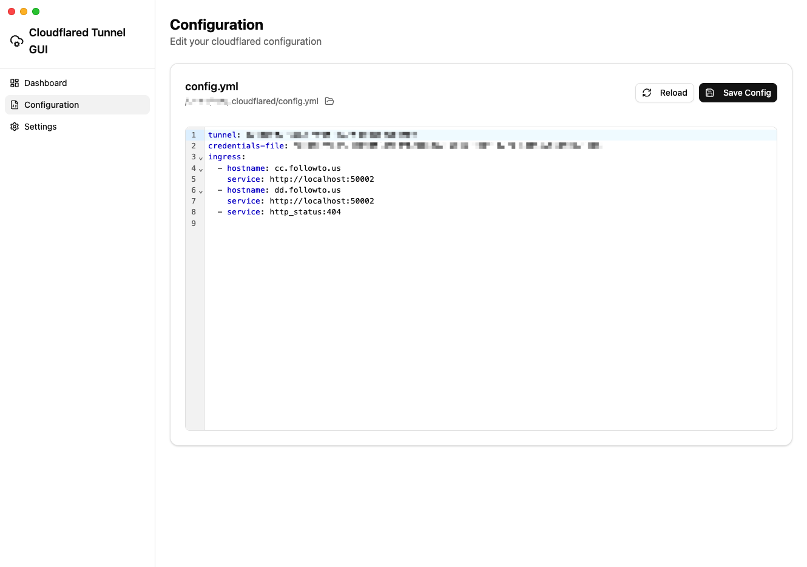
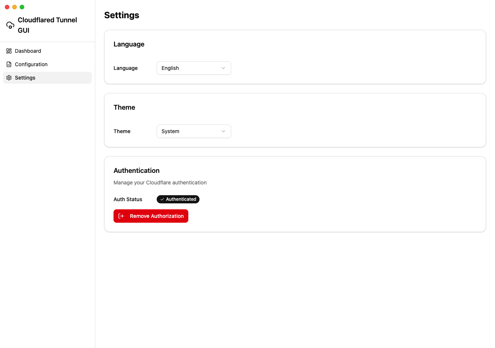

# Cloudflared Tunnel GUI

[简体中文 README](README.zh_hans.md)

> ⚠️ **Note**: This project was created through vibe coding (AI-assisted development). Tested and verified on macOS.

A lightweight desktop GUI (Electron + React + Vite) for managing Cloudflare Tunnel (`cloudflared`) runtime and editing your local `~/.cloudflared/config.yml` ingress rules.

## Screenshots

| Dashboard | Configuration | Settings |
|:---------:|:-------------:|:--------:|
|  |  |  |

## Features

- Start/stop `cloudflared tunnel run` and view logs
- Read/edit your `~/.cloudflared/config.yml` (YAML)
- Manage ingress rules via a simple form UI (writes to `ingress`)
- Cloudflare authentication: trigger `cloudflared tunnel login` and show auth status
- Language switch (English/中文) and theme switch

## Prerequisites

- Node.js (recommended: modern LTS)
- pnpm
- `cloudflared` installed and available in your `PATH`
  - macOS (Homebrew): `brew install cloudflare/cloudflare/cloudflared`
  - Or download from Cloudflare and ensure `cloudflared` is executable

## Development

```bash
pnpm install
pnpm electron:dev
```

This starts Vite and then launches Electron after the dev server is ready.

## Build

```bash
pnpm install
pnpm electron:build
```

Artifacts are produced under `release/` (configured by `electron-builder`).

## How configuration is handled

- Config file path: `~/.cloudflared/config.yml`
- The app reads the config on startup.
- When you add/edit/delete rules in the UI, the app updates `ingress` and saves the file.
- The app creates `~/.cloudflared/` if it does not exist and backs up existing config before saving.

## Troubleshooting

- **"cloudflared not found"**
  - Ensure `cloudflared` is installed and available in `PATH`.
  - Restart the app after installing.

- **Tunnel fails to start**
  - Check the log panel in Dashboard.
  - Validate your `config.yml` is valid YAML and `ingress` rules are correct.
